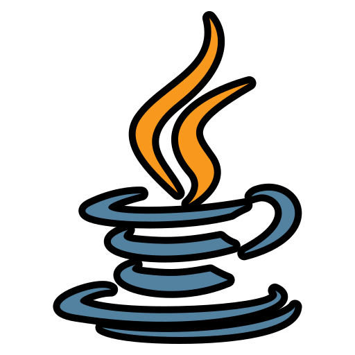
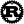

### Hi I'm Omar 👋
I'm a Senior Backend developer enthuastic in Crypto, Security, videogames, 3d animation and music.  
I'm currently working as a backend developer in Rust at a security company focused on detecting and applying vaccination against ransomware threats on Linux and Windows systems.  
I'm currently learning DEFI, Solidity, Rust, 3d sculpting with Zbrush, 3d animation and modeling with Maya, Blender and Houdini, and also creating some videogames with Unreal 4 and 5, and even with Unity.  
Also investigating how to work linux Kernel and learning about EBPF, even though security in smart contracts in Cyfrin Updraft platform.  

 

## 📫 Find me on:

## Top Tools and languages:

  
  
  
  
  
  
  
  
  
  

<!--
**willowsenator/willowsenator** is a ✨ _special_ ✨ repository because its `README.md` (this file) appears on your GitHub profile.

Here are some ideas to get you started:

- 🔭 I’m currently working on ...
- 🌱 I’m currently learning ...
- 👯 I’m looking to collaborate on ...
- 🤔 I’m looking for help with ...
- 💬 Ask me about ...
- 📫 How to reach me: ...
- 😄 Pronouns: ...
- ⚡ Fun fact: ...
-->
